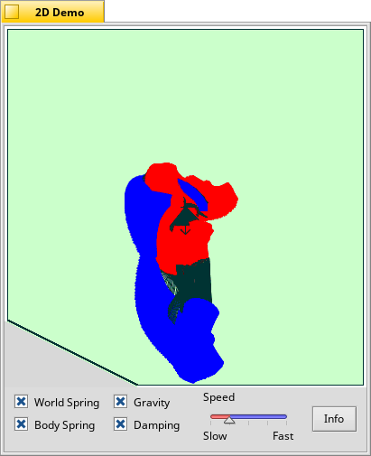

2D Physics Test Program
==
A cheesy test harness for 2D physics.

Author: Andreas Kaenner  
email: <kaenner@server.et-inf.fho-emden.de>  
<http://www.archi-line.de/kaenner/>  
Release: 22.5.98  
Notes: (c) by Chris Hecker <http://www.d6.com/users/checker>  
Ported to BeOS by Andreas Kaenner.
